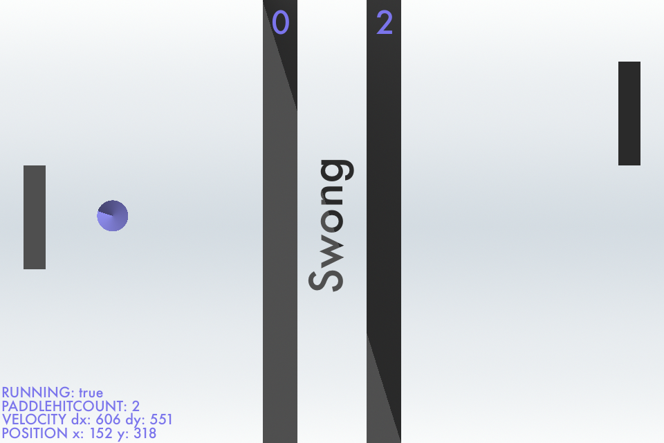

Swong
========

Swift + Pong = Swong  
made using Apple's Sprite Kit framework  

### Features
* basic pong gameplay (two player local multiplayer)
* animations (ball reset animation and text fading in and out)
* debug menu
* highly customizable
  - start speeds
  - minimum / max speeds
  - speed multipliers
  - distance between paddle and side
  - score needed to win
  - etc.

### Screenshots

